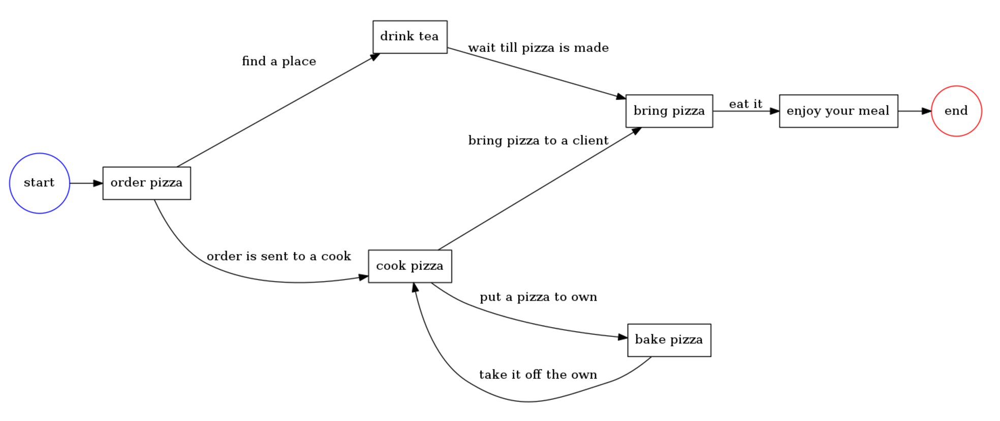

# Process virtual machine

The library provides us with a frame to build a [workflow](https://en.wikipedia.org/wiki/Workflow) or business processes such as [BPMN](http://www.bpmn.org/). 
It works like this: you build a process, create nodes and transitions, link them up. Than you can do:

* Save process and execute later.
* Clone and execute several processes.
* Pause & continue execution. 
* Supports async transition. Execute tasks in parallel.
* Supports fork-join, conditions, cycles 

It is backed up by [workflow nets (WF-nets)](https://en.wikipedia.org/wiki/Petri_net) and [graphs](https://en.wikipedia.org/wiki/Graph_theory) theories. . Here's a good [post on how Petri Nets works](https://www.techfak.uni-bielefeld.de/~mchen/BioPNML/Intro/pnfaq.html)

        
## Examples

* [Sequence](docs/sequence-example.md)
* [Fork](docs/fork-example.md)
* [Conditions](docs/conditions-example.md)
* [Cycles](docs/cycle-example.md)
* [Synchronization](docs/synchronization-example.md)
* [Pause and continue](docs/pause-and-continue-example.md)
* [Parallel execution](docs/parallel-execution-with-enqueue.md) (require enqueue/simple-client)
* [Delayed transtions](docs/delayed-execution-with-quartz.md) (require formapro/php-quartz)
* [Mongo storage](docs/mongo-storage-example.md)
* [Gallery](docs/gallery.md)
* [Online demo](https://pvm-demo.forma-pro.com), [code](https://github.com/formapro/pvm-demo)

## Developed by Forma-Pro

Forma-Pro is a full stack development company which interests also spread to open source development. 
Being a team of strong professionals we have an aim an ability to help community by developing cutting edge solutions in the areas of e-commerce, docker & microservice oriented architecture where we have accumulated a huge many-years experience. 
Our main specialization is Symfony framework based solution, but we are always looking to the technologies that allow us to do our job the best way. We are committed to creating solutions that revolutionize the way how things are developed in aspects of architecture & scalability.

If you have any questions and inquires about our open source development, this product particularly or any other matter feel free to contact at opensource@forma-pro.com
