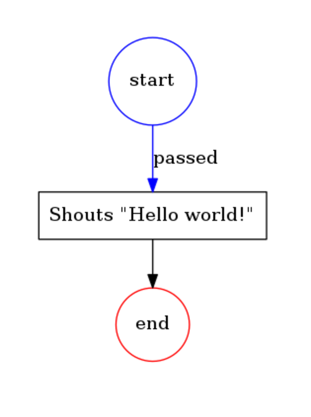

# Process virtual machine

The library provides us with a frame to build a [workflow](https://en.wikipedia.org/wiki/Workflow), business processes such as [BPMN](http://www.bpmn.org/). 
It works like this: you build a process, create nodes and transitions, link them up. Than you can do:

* It could be saved and used later. 
* It could be executed with the process engine. 
* The processes could be visualized.
* Tasks could be executed asynchronously 
* It shows the current state and reflect any chagnes or movements

It is backed up by [workflow nets (WF-nets)](https://en.wikipedia.org/wiki/Petri_net) and [graphs](https://en.wikipedia.org/wiki/Graph_theory) theories.
 
## The "Hello world!" example

Let's build our first process and execute it. It'll contain one single task that prints "Hello world" to the output.  

```php
<?php
namespace Acme;

use Formapro\Pvm\DefaultBehaviorRegistry;
use Formapro\Pvm\CallbackBehavior;
use Formapro\Pvm\ProcessEngine;
use Formapro\Pvm\Process;

$registry = new DefaultBehaviorRegistry();
$registry->register('hello_world', new CallbackBehavior(function() {
    echo 'Hello world!';
}));

$process = new Process();
$node = $process->createNode();
$node->setLabel('Shouts "Hello world!"');
$node->setBehavior('hello_world');

$transition = $process->createTransition(null, $node);
$token = $process->createToken($transition);

(new ProcessEngine($registry))->proceed($token);

// Prints "Hello world!"
```

The diagram: 

## Fork process example

The example shows how to fork execution. It is still done synchronously internally so the first will be executed `bar` and after `baz`.
The async execution is supported and covered in this tutorial.

```php
<?php
namespace Acme;

use Formapro\Pvm\DefaultBehaviorRegistry;
use Formapro\Pvm\CallbackBehavior;
use Formapro\Pvm\ProcessEngine;
use Formapro\Pvm\Process;

$registry = new DefaultBehaviorRegistry();
$registry->register('foo', new CallbackBehavior(function() {
    echo 'Foo ';
}));
$registry->register('bar', new CallbackBehavior(function() {
    echo 'BAR ';
}));
$registry->register('baz', new CallbackBehavior(function() {
    echo 'BAZ ';
}));

$process = new Process();
$foo = $process->createNode();
$foo->setLabel('foo');
$foo->setBehavior('foo');

$bar = $process->createNode();
$bar->setLabel('bar');
$bar->setBehavior('bar');

$baz = $process->createNode();
$baz->setLabel('baz');
$baz->setBehavior('baz');

$process->createTransition($foo, $bar);
$process->createTransition($foo, $baz);
$transition = $process->createTransition(null, $foo);

$token = $process->createToken($transition);

(new ProcessEngine($registry))->proceed($token);

// Prints "Foo Bar Baz "
```

The diagram: 
        
## Resources

* [Documentation](https://github.com/formapro/pvm/blob/master/docs/index.md)
* [Issue Tracker](https://github.com/formapro/pvm/issues)

## Developed by Forma-Pro

Forma-Pro is a full stack development company which interests also spread to open source development. 
Being a team of strong professionals we have an aim an ability to help community by developing cutting edge solutions in the areas of e-commerce, docker & microservice oriented architecture where we have accumulated a huge many-years experience. 
Our main specialization is Symfony framework based solution, but we are always looking to the technologies that allow us to do our job the best way. We are committed to creating solutions that revolutionize the way how things are developed in aspects of architecture & scalability.

If you have any questions and inquires about our open source development, this product particularly or any other matter feel free to contact at opensource@forma-pro.com
