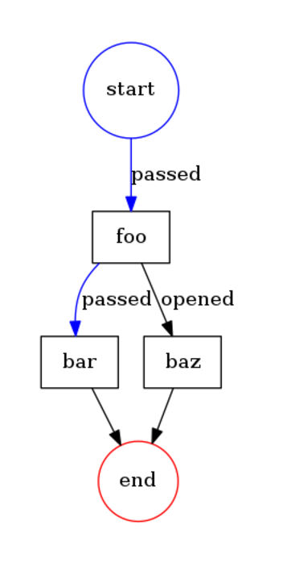

# Conditions Example

The example shows how you can do "if-else" logic".

```php
<?php
namespace Acme;

use Formapro\Pvm\DefaultBehaviorRegistry;
use Formapro\Pvm\CallbackBehavior;
use Formapro\Pvm\ProcessEngine;
use Formapro\Pvm\Process;
use Formapro\Pvm\Token;

$registry = new DefaultBehaviorRegistry();
$registry->register('print_out_node_label', new CallbackBehavior(function(Token $token) {
    echo $token->getTransition()->getTo()->getLabel().' ';
}));
$registry->register('condition', new CallbackBehavior(function(Token $token) {
    return ['first'];
}));

$process = new Process();
$foo = $process->createNode();
$foo->setLabel('foo');
$foo->setBehavior('condition');

$bar = $process->createNode();
$bar->setLabel('bar');
$bar->setBehavior('print_out_node_label');

$baz = $process->createNode();
$baz->setLabel('baz');
$baz->setBehavior('print_out_node_label');

$process->createTransition($foo, $bar, 'first');
$process->createTransition($foo, $baz, 'second');
$transition = $process->createTransition(null, $foo);

$token = $process->createToken($transition);

(new ProcessEngine($registry))->proceed($token);

// Prints "bar "
```

The diagram: 



[Back](../README.md)