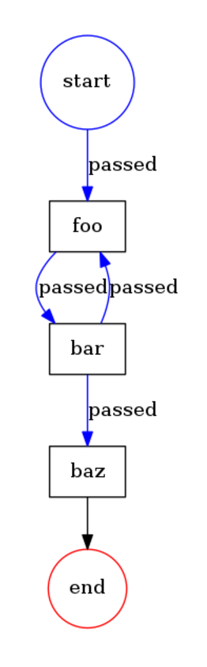

# Cycle Example

The example shows how tasks could be executed several times in a cycle and how it could be broken.

```php
<?php
namespace Acme;

use Formapro\Pvm\DefaultBehaviorRegistry;
use Formapro\Pvm\CallbackBehavior;
use Formapro\Pvm\ProcessEngine;
use Formapro\Pvm\Process;
use Formapro\Pvm\Token;
use function Makasim\Values\get_value;
use function Makasim\Values\set_value;

$registry = new DefaultBehaviorRegistry();
$registry->register('print_label', new CallbackBehavior(function(Token $token) {
    echo $token->getTransition()->getTo()->getLabel().' ';
}));
$registry->register('go_back_first_three_times', new CallbackBehavior(function(Token $token) {

    $counter = get_value($token, 'counter', 0);
    $counter++;
    set_value($token, 'counter', $counter);

    return $counter < 3 ? ['back'] : ['forth'];
}));

$process = new Process();
$foo = $process->createNode();
$foo->setLabel('foo');
$foo->setBehavior('print_label');

$bar = $process->createNode();
$bar->setLabel('bar');
$bar->setBehavior('go_back_first_three_times');

$baz = $process->createNode();
$baz->setLabel('baz');
$baz->setBehavior('print_label');

$process->createTransition($foo, $bar);
$process->createTransition($bar, $baz, 'forth');
$process->createTransition($bar, $foo, 'back');
$transition = $process->createTransition(null, $foo);

$token = $process->createToken($transition);

(new ProcessEngine($registry))->proceed($token);

// Prints "foo foo foo baz "
```

The diagram: 



[Back](../README.md)