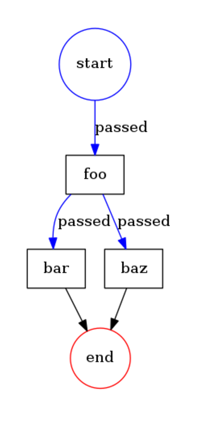

## Fork process example

The example shows how to fork execution. It is still done synchronously internally so the first will be executed `bar` and after `baz`.
The async execution is supported and covered in this tutorial.

```php
<?php
namespace Acme;

use Formapro\Pvm\DefaultBehaviorRegistry;
use Formapro\Pvm\CallbackBehavior;
use Formapro\Pvm\ProcessEngine;
use Formapro\Pvm\Process;
use Formapro\Pvm\Token;
use Formapro\Pvm\Uuid;
use function Makasim\Values\register_object_hooks;

register_object_hooks();

$registry = new DefaultBehaviorRegistry();
$registry->register('print_label', new CallbackBehavior(function(Token $token) {
    echo $token->getCurrentTransition()->getTransition()->getTo()->getLabel().' ';
}));

$process = Process::create();
$process->setId(Uuid::generate());

$foo = $process->createNode();
$foo->setLabel('foo');
$foo->setBehavior('print_label');

$bar = $process->createNode();
$bar->setLabel('bar');
$bar->setBehavior('print_label');

$baz = $process->createNode();
$baz->setLabel('baz');
$baz->setBehavior('print_label');

$process->createTransition($foo, $bar);
$process->createTransition($foo, $baz);
$transition = $process->createTransition(null, $foo);

$engine = new ProcessEngine($registry);
$token = $engine->createProcessToken($process, $transition);
$engine->proceed($token);

// Prints "foo bar baz "
```

The diagram: 



[Back](../README.md)
