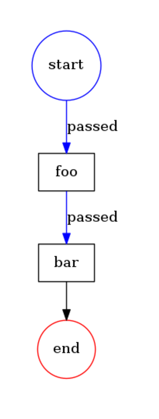

# Sequence example 

The example shows how you can execute tasks in a sequence.  

```php
<?php
namespace Acme;

use Formapro\Pvm\DefaultBehaviorRegistry;
use Formapro\Pvm\CallbackBehavior;
use Formapro\Pvm\ProcessEngine;
use Formapro\Pvm\Process;
use Formapro\Pvm\Token;
use Formapro\Pvm\ObjectBuilderHook;

(new ObjectBuilderHook())->register();

$registry = new DefaultBehaviorRegistry();
$registry->register('print_label', new CallbackBehavior(function(Token $token) {
    echo $token->getTransition()->getTo()->getLabel().' ';
}));

$process = Process::create();
$fooNode = $process->createNode();
$fooNode->setLabel('foo');
$fooNode->setBehavior('print_label');

$barNode = $process->createNode();
$barNode->setLabel('bar');
$barNode->setBehavior('print_label');

$process->createTransition($fooNode, $barNode);

$transition = $process->createTransition(null, $fooNode);
$token = $process->createToken($transition);

(new ProcessEngine($registry))->proceed($token);

// Prints "foo bar "
```

The diagram: 



[Back](../README.md)

