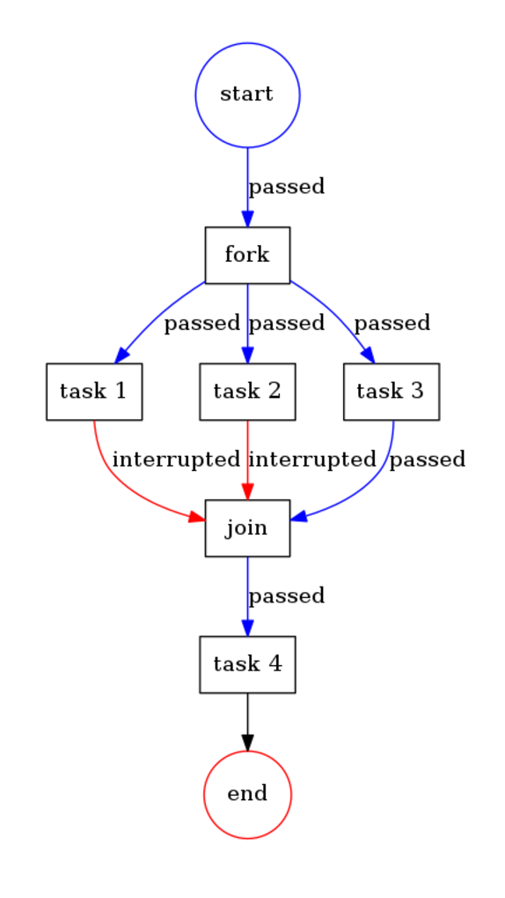

# Synchronization example

The example shows how task execution could be synced. The task4 is execute only when all the rest are done.

```php
<?php
namespace Acme;

use Formapro\Pvm\DefaultBehaviorRegistry;
use Formapro\Pvm\Exception\InterruptExecutionException;
use Formapro\Pvm\CallbackBehavior;
use Formapro\Pvm\ProcessEngine;
use Formapro\Pvm\Process;
use Formapro\Pvm\Token;
use Formapro\Pvm\Uuid;
use function Makasim\Values\register_object_hooks;

register_object_hooks();

$registry = new DefaultBehaviorRegistry();
$registry->register('print_label', new CallbackBehavior(function(Token $token) {
    echo $token->getCurrentTransition()->getTransition()->getTo()->getLabel().' ';
}));
$registry->register('fork', new CallbackBehavior(function (Token $token) {
    $transitions = $token->getProcess()->getOutTransitions($token->getCurrentTransition()->getTransition()->getTo());

    $transitions[0]->setWeight(1);
    $transitions[1]->setWeight(1);
    $transitions[2]->setWeight(1);

    return $transitions;
}));
$registry->register('join', new CallbackBehavior(function (Token $token) {
    static $weight = 0;
    $weight += $token->getCurrentTransition()->getWeight();

    if ($weight === 3) {
        return;
    }

    // wait for other tasks to be completed
    throw new InterruptExecutionException();
}));

$process = Process::create();
$process->setId(Uuid::generate());

$fork = $process->createNode();
$fork->setLabel('fork');
$fork->setBehavior('fork');

$task1 = $process->createNode();
$task1->setLabel('task 1');
$task1->setBehavior('print_label');
$task1->setOption('text', 'task 1');

$task2 = $process->createNode();
$task2->setLabel('task 2');
$task2->setBehavior('print_label');
$task2->setOption('text', 'task 2');

$task3 = $process->createNode();
$task3->setLabel('task 3');
$task3->setBehavior('print_label');
$task3->setOption('text', 'task 3');

$join = $process->createNode();
$join->setLabel('join');
$join->setBehavior('join');

$task4 = $process->createNode();
$task4->setLabel('task 4');
$task4->setBehavior('print_label');
$task4->setOption('text', 'task 4');

$start = $process->createTransition(null, $fork);
$process->createTransition($fork, $task1);
$process->createTransition($fork, $task2);
$process->createTransition($fork, $task3);
$process->createTransition($task1, $join);
$process->createTransition($task2, $join);
$process->createTransition($task3, $join);
$process->createTransition($join, $task4);

$engine = new ProcessEngine($registry);
$engine->proceed($process->createToken($start));

// Prints "task 1 task 2 task 3 task 4 "
```

The diagram: 



[Back](../README.md)